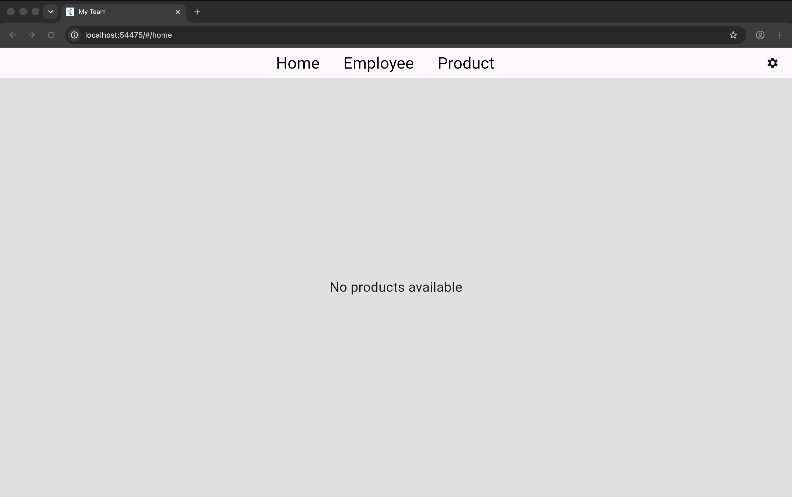
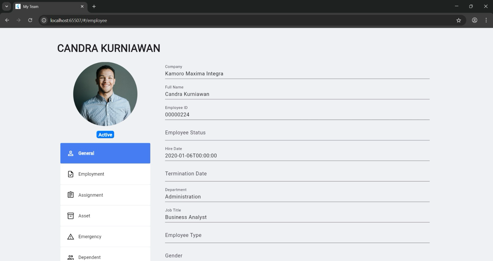
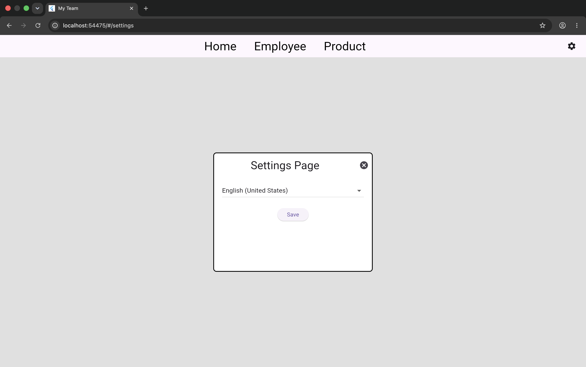
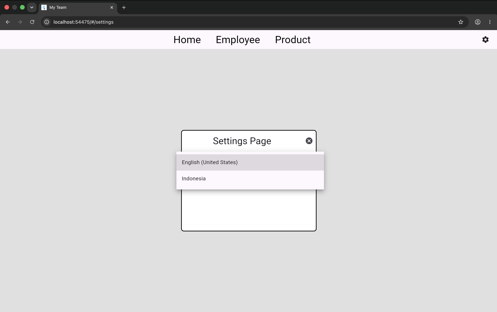
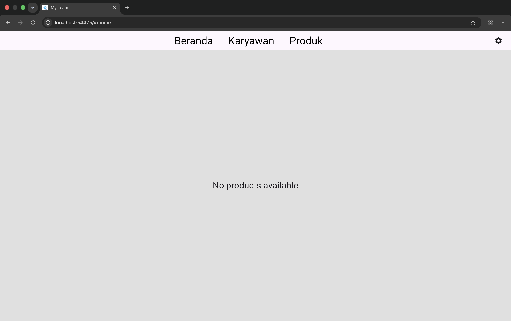

# Kamoro MyTeams (Flutter Web)

A Flutter Web employee and product management system built using **Provider**, **Navigator 2.0**, **GetIt**, and **Easy Localization** following a modular, feature-based architecture.

---

## Key Highlights

- Developed a responsive **Flutter Web** application
- Implemented **Provider** for application state management
- Built custom navigation using **Navigator 2.0**
- Used **GetIt** for dependency injection
- Added multilingual support using **Easy Localization**
- Applied a modular feature-based architecture for maintainability and scalability

---

## Overview

Kamoro MyTeams is a Flutter Web application designed for managing employees and products through a clean and modular interface.

The application separates business logic from presentation using Provider and dependency injection while supporting custom routing, localization, and reusable UI components.

This project demonstrates how a production-style Flutter application can be structured for scalability and maintainability.

---

## Technologies Used

- **Framework:** Flutter Web
- **Language:** Dart
- **State Management:** Provider
- **Dependency Injection:** GetIt
- **Routing:** Navigator 2.0
- **Localization:** Easy Localization
- **Architecture:** Feature-Based Modular Architecture

---

## Features

- Employee management interface
- Employee profile page
- Product management interface
- Product search functionality
- Settings page
- Multi-language support
- Custom routing
- Provider state management
- Dependency injection
- Responsive web interface

---

## Project Structure

```text
lib/
├── initialization/
├── localizations/
├── models/
├── providers/
├── repositories/
├── routing/
├── ui/
│   ├── employee/
│   ├── home/
│   ├── product/
│   ├── scaffold/
│   └── settings/
└── main.dart
```

---

## Architecture

The application follows a modular architecture.

- **Providers** manage application state.
- **Repositories** separate business logic from the UI.
- **Routing** manages navigation using Navigator 2.0.
- **Models** define application data.
- **UI** contains reusable feature-specific screens.
- **Initialization** configures dependency injection and application services.

---

## Screenshots

### Home



### Employee





### Product


### Settings





---

## Getting Started

Clone the repository:

```bash
git clone https://github.com/KennethAnthonyYusuf/flutter-web.git
cd flutter-web
```

Install dependencies:

```bash
flutter pub get
```

Run the application:

```bash
flutter run
```

---

## Project Status

This repository contains the Flutter Web frontend.

The user interface, routing, localization, and application architecture are implemented.

The backend API and database are maintained in a separate repository.

---

## Technical Highlights

### Provider State Management

Uses Provider to manage shared application state while separating business logic from presentation.

### Navigator 2.0

Implements declarative routing and custom route parsing for scalable page navigation.

### Dependency Injection

Uses GetIt to register and access shared services throughout the application.

### Localization

Supports multiple languages using Easy Localization.

### Modular Architecture

Organises the project into independent feature modules, improving maintainability and scalability.

### Responsive UI

Designed to provide a consistent experience across different screen sizes.

---

## Why This Project Matters

This project demonstrates the ability to:

- build modern Flutter Web applications
- implement scalable state management
- design modular software architecture
- develop responsive user interfaces
- manage application routing
- apply dependency injection
- support internationalization and localization
- organise large Flutter projects using feature-based architecture

---

## Author

**Kenneth Anthony Yusuf**