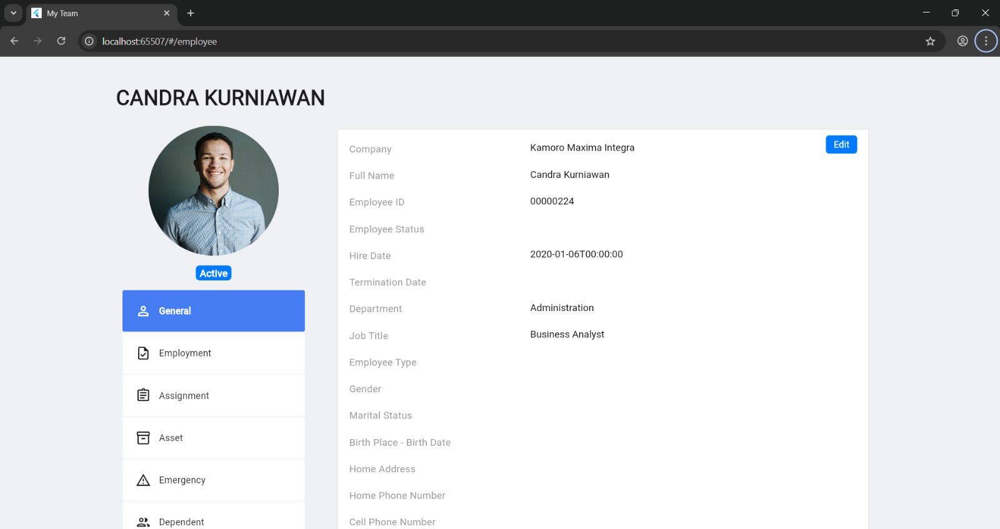
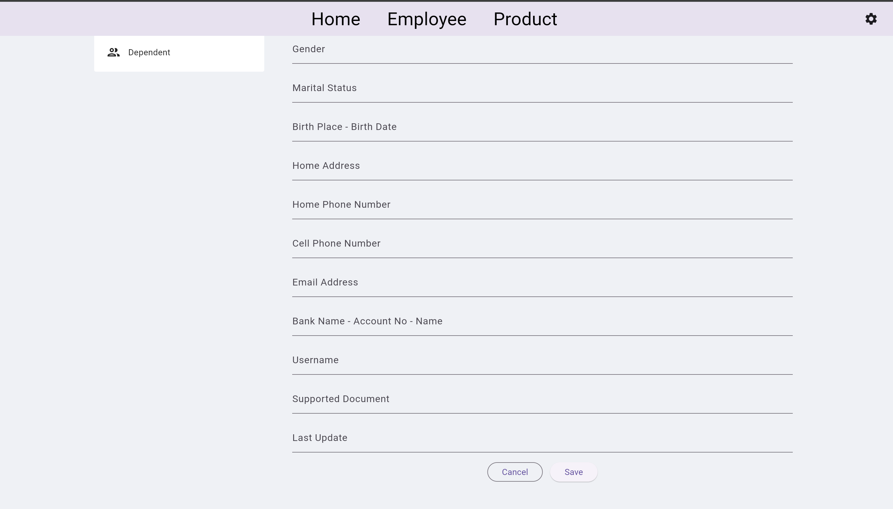
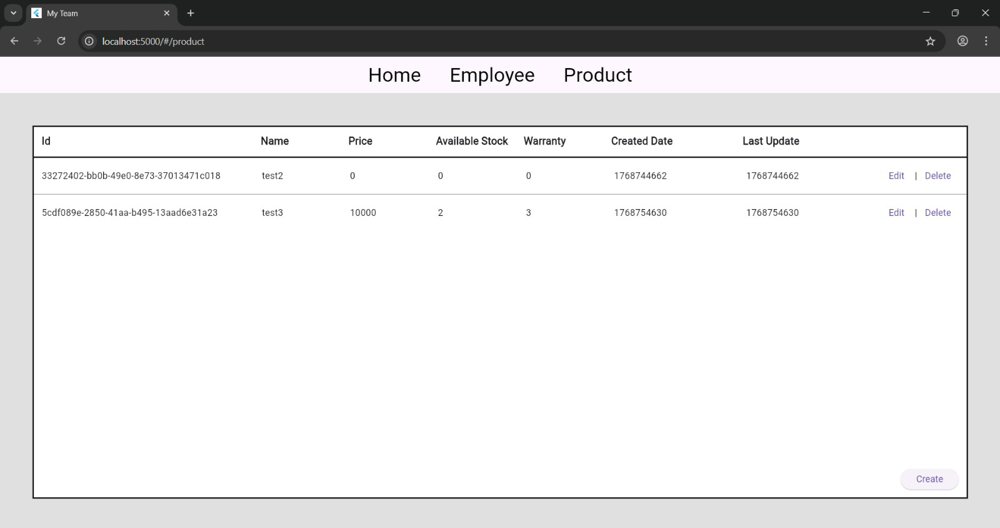
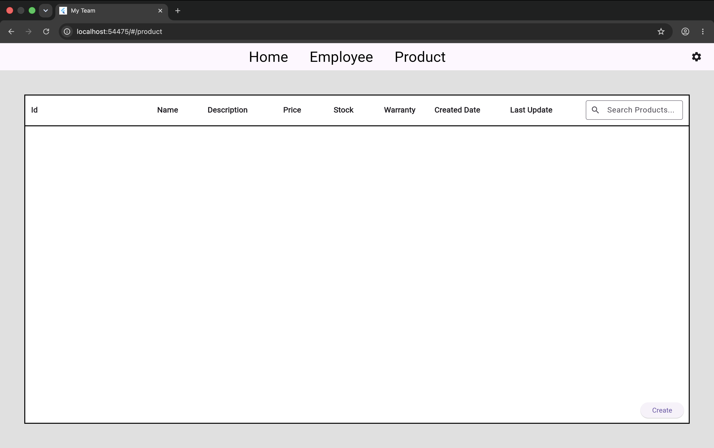
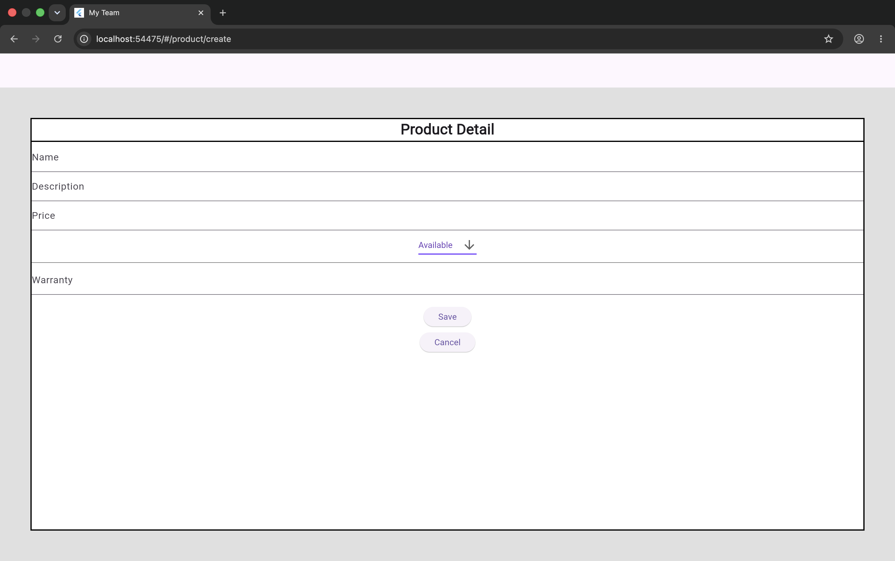
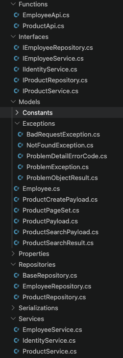
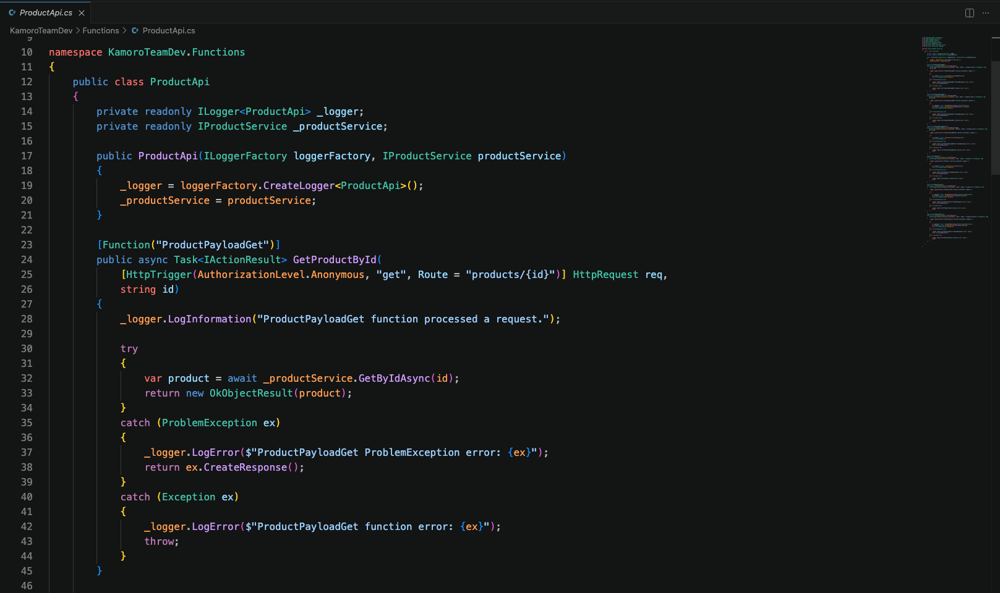
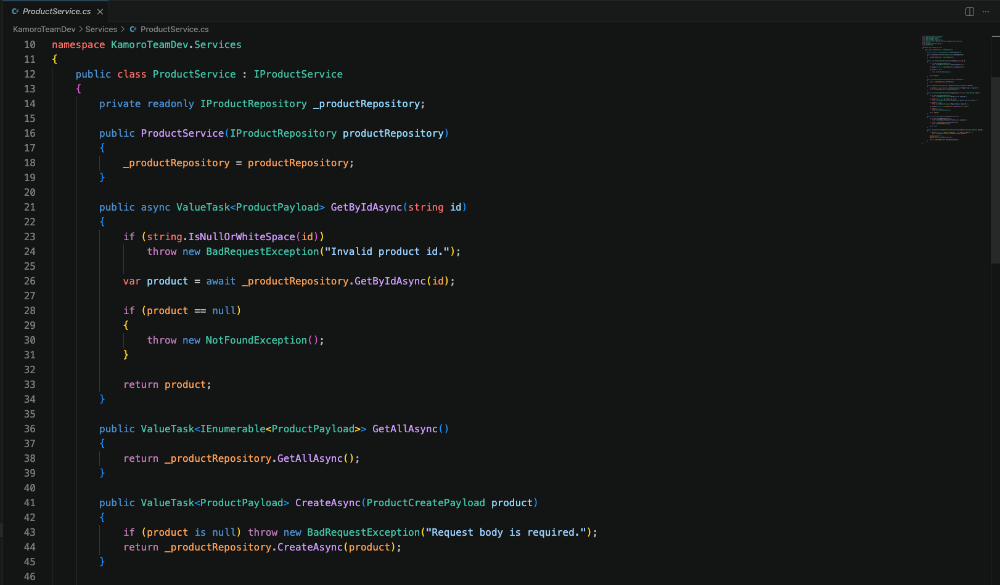
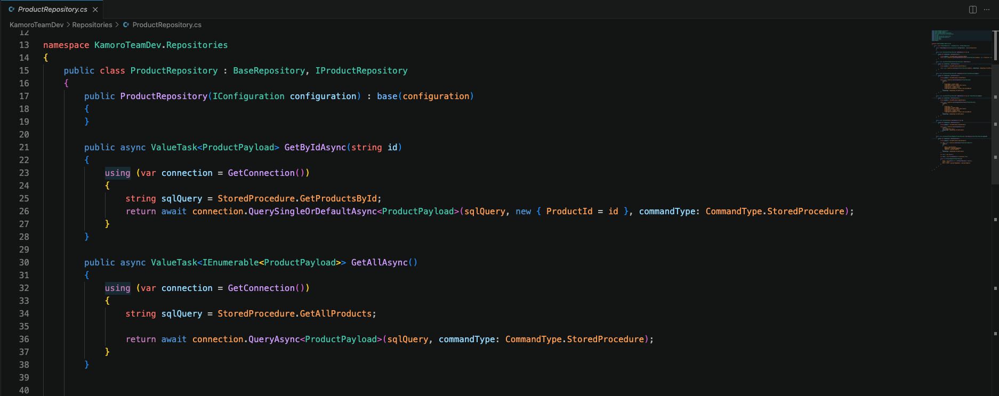

# Kamoro MyTeams (Flutter Web)

A Flutter Web employee and product management system built using **Provider**, **Navigator 2.0**, **GetIt**, and **Easy Localization**, following a modular feature-based architecture inspired by production applications.

---

## Key Highlights

- Developed a responsive **Flutter Web** application
- Implemented **Provider** for application state management
- Built custom navigation using **Navigator 2.0**
- Used **GetIt** for dependency injection
- Added multilingual support using **Easy Localization**
- Applied a modular feature-based architecture for scalability and maintainability
- Contributed to backend API development using **ASP.NET Core** and layered architecture

---

## Overview

Kamoro MyTeams is a Flutter Web application designed for managing employees and products through a clean, modular, and maintainable architecture.

The application separates presentation, state management, routing, and business logic while supporting localization and dependency injection. The project follows software engineering best practices commonly used in production environments.

---

## Technologies Used

- **Framework:** Flutter Web
- **Language:** Dart
- **State Management:** Provider
- **Dependency Injection:** GetIt
- **Routing:** Navigator 2.0
- **Localization:** Easy Localization
- **Architecture:** Feature-Based Modular Architecture

---

## Features

- Employee management interface
- Employee profile page
- Product management interface
- Product search functionality
- Settings page
- Multi-language support
- Custom routing
- Provider state management
- Dependency injection
- Responsive web interface

---

## Project Structure

```text
lib/
├── initialization/
├── localizations/
├── models/
├── providers/
├── repositories/
├── routing/
├── ui/
│   ├── employee/
│   ├── home/
│   ├── product/
│   ├── scaffold/
│   └── settings/
└── main.dart
```

---

## Architecture

The application follows a modular architecture.

- **Providers** manage application state.
- **Repositories** separate business logic from the UI.
- **Routing** manages navigation using Navigator 2.0.
- **Models** define application data.
- **UI** contains reusable feature-specific screens.
- **Initialization** configures dependency injection and shared application services.

---

## Screenshots

### Home


---

### Employee






---

### Product







---

### Settings


---

## Backend Architecture (Contribution)

In addition to the Flutter frontend, I contributed to the backend implementation using **ASP.NET Core**.

The backend follows a layered architecture consisting of:

- API Functions
- Services
- Repositories
- Models
- Interfaces
- Dependency Injection
- Custom Exception Handling

### Project Structure



### Product API Endpoint



### Product Service Layer



### Product Repository



---

## Getting Started

Clone the repository:

```bash
git clone https://github.com/KennethAnthonyYusuf/flutter-web.git
cd flutter-web
```

Install dependencies:

```bash
flutter pub get
```

Run the application:

```bash
flutter run
```

---

## Project Status

This repository contains the Flutter Web frontend developed during my internship.

The project showcases the application's architecture, user interface, routing, localization, state management, and overall software design.

Some functionality depends on backend services and a database that are maintained separately and are therefore not included in this repository. As a result, features requiring live backend data may not be fully functional.

---

## Technical Highlights

### Provider State Management

Uses Provider to manage shared application state while separating business logic from presentation.

### Navigator 2.0

Implements declarative routing and custom route parsing for scalable page navigation.

### Dependency Injection

Uses GetIt to register and access shared services throughout the application.

### Localization

Supports multiple languages using Easy Localization.

### Modular Architecture

Organises the application into independent feature modules for improved maintainability and scalability.

### Responsive UI

Designed to provide a consistent experience across different screen sizes.

### Backend Design

Contributed to an ASP.NET Core backend implementing a layered architecture with API controllers, service layer, repository pattern, dependency injection, and custom exception handling.

---

## Why This Project Matters

This project demonstrates the ability to:

- build modern Flutter Web applications
- implement scalable state management
- design modular software architecture
- develop responsive user interfaces
- manage application routing
- apply dependency injection
- support internationalization and localization
- contribute to backend API development
- work with layered software architecture
- organise large applications using feature-based design

---

## Author

**Kenneth Anthony Yusuf**